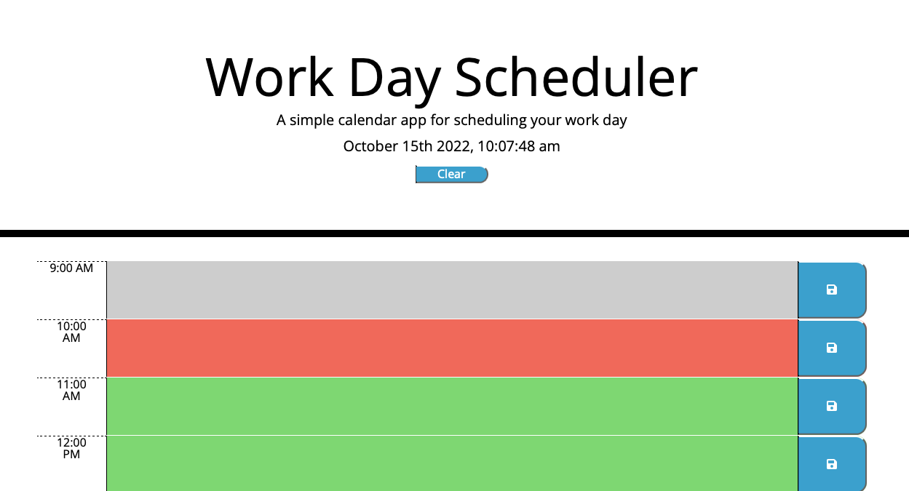

# Work Day Scheduler

## Description
The creation of a workday scheduler necessitates the use of third-party APIs, which presents a challenge.The current day ought to be displayed at the top of the calendar when the planner is opened.Time blocks for standard business hours should be displayed to the user as they scroll down.Color-coding each time block should indicate the past, present, or future.It should be possible for the user to enter an event when a time block is clicked.The text for that event ought to be saved in the browser's local storage when the save button is clicked.The saved events ought to remain on the webpage even after the page is refreshed.

## Installation

Clone the repository locally and double click `index.html` or click on the link below in the usage section

## Usage

Screenshot of website

To visit please click on link [link](https://vsoto7697.github.io/Vsotoworkdayscheduler)

## Challenges
I had difficulty creating a predetermined interval that runs a function every hour.I also had trouble deploying my URL and making use of the github push and pull features.My biggest obstacle, in my opinion, was coming up with a function that used the timestampanddescription class and the time id. This function would have generated an if else statement that would have assigned classes the appropriate colors based on whether the time was in the past (grey), present (red), or future (green).

## License

Copyright (c) 2022 Victor Soto